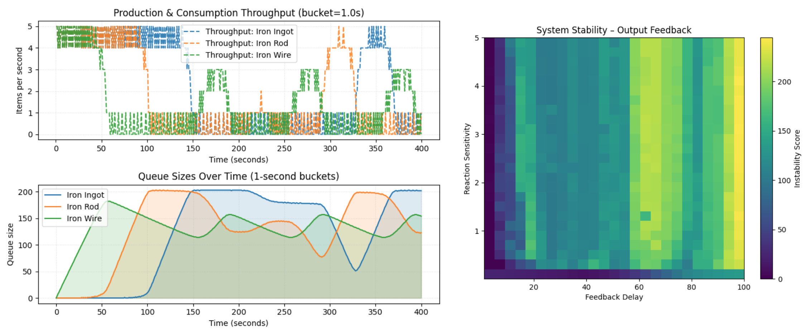

# Sequential Producer-Consumer System

## Overview
A discrete event simulation tool used to simulate sequential composed producer–consumer systems. The internal dynamics of the simulation are recorded and expressed as diagrams of throughput and queue occupancy. The simulator is used to understand the effect of the composition of such systems under different conditions exploring sequence length, feedback type and external shocks.

## Tech Stack
- Python 3  
- NumPy (numerical computation)  
- Matplotlib (visualisation)  
- Optuna (parameter tuning)

## Key Features
- Event-driven simulation of multi-stage producer–consumer systems
- Support for different feedback strategies (input/output/dual)  
- Visualisation of throughput and queue dynamics over time
- System stability diagrams and parameter tuning using Optuna 

## How to Run

1. Clone the repository  
2. Install dependencies using: `pip install -r requirements.txt`
3. Run the simulation using: `python sim_runtime.py`